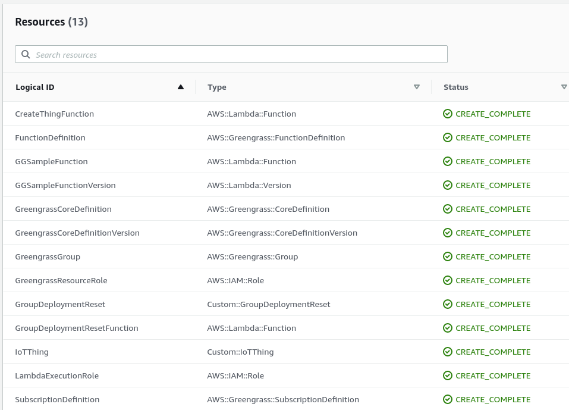
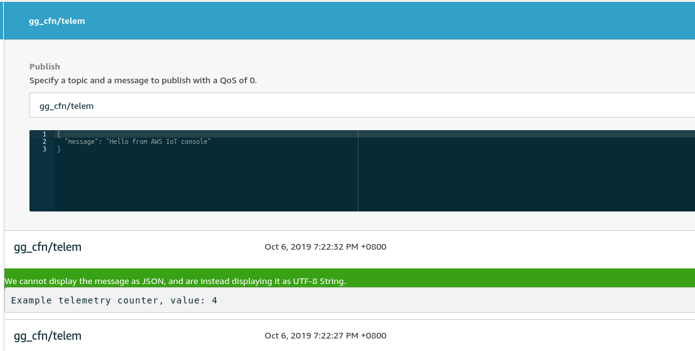

# AWS Greengrass Cloudformation - Raspberry Pi

AWS IoT Greengrass is a managed service that allows you to easily manage and communicate with edge devices. It sells itself as a central way to deploy to huge fleets of devices in a repeatable way.

The irony of this is that deploying the foundation of AWS Greengrass can be quite complex and messy. In the offical guide for Greengrass Core, AWS recommends using the `Easy Creation` button. This is perfectly fine for testing purposes, however if you are deploying production workloads then repeatability is really key.

CloudFormation resources are available for AWS Greengrass however the setup process can be rather complex when your device isn't sitting in AWS. This blog post is a continuation of an existing post on the AWS Blog called [Automating AWS IoT Greengrass Setup With AWS CloudFormation](https://aws.amazon.com/blogs/iot/automating-aws-iot-greengrass-setup-with-aws-cloudformation/). This post works fine for setups where EC2 is used, however there's a gap for people who deploy AWS IoT Greengrass Core to devices in the field.

## Pre-requisites

* AWS Account with [AWS CLI Setup](https://docs.aws.amazon.com/cli/latest/userguide/cli-chap-configure.html)
* Edge Device, in the case of this post I'm using a [Raspberry Pi Zero W](https://www.raspberrypi.org/products/raspberry-pi-zero-w/)
* Clone [t04glovern/aws-greengrass-cfn](https://github.com/t04glovern/aws-greengrass-cfn) locally

## Setting up a Raspberry Pi

For our deployment we'll be using a Raspberry Pi Zero W, however feel free to use any device you see fit. If you're working on a Raspberry Pi as well you can follow the next steps to setup a new image.

Start of by downloading the [Rasbian lite image](https://www.raspberrypi.org/downloads/raspbian/). This can be done using `wget` if you are that way inclined.

```bash
wget https://downloads.raspberrypi.org/raspbian_lite/images/raspbian_lite-2019-09-30/2019-09-26-raspbian-buster-lite.zip
```

### Burn Image

Next we need to burn the image with [Etcher](https://www.balena.io/etcher/) or a similar imaging software.


Once the MicroSD card is flashed with Rasbian continue to the next step.

### Setup WiFi

Setting up WiFi and SSH access in a headless fashion is really useful if you haven't got a monitor around. It's already very convinient for bulk deployments.

This might be different based on your OS, the general idea is that you will need to create:

* An empty file called `ssh` in the `/boot/` partition
* A file called `wpa_supplicant.conf` in the same partition

```bash
touch /Volumes/boot/ssh
touch /Volumes/boot/wpa_supplicant.conf
nano /Volumes/boot/wpa_supplicant.conf

# Add the following config
country=AU
ctrl_interface=DIR=/var/run/wpa_supplicant GROUP=netdev
update_config=1

network={
    ssid="NETWORK-NAME"
    psk="NETWORK-PASSWORD"
}
```

**NOTE**: *Be sure to update your WiFi networking information. If you are using Ethernet you can skip the wpa_supplicant.conf step.*

### Connect to Pi

Plugin the Raspberry Pi and give it a couple minutes to first boot up. You can then SSH into your raspberry pi by either using [Putty](https://www.putty.org/) on Windows or `ssh` on MacOS & Unix

```bash
ssh-keygen -R raspberrypi.local
ssh pi@raspberrypi.local
# password: raspberry
```

Once connected, we update the system with the latest packages and install [Python Pip](https://pypi.org/project/pip/) for later use with the Greengrass SDK.

```bash
sudo apt-get update -y
sudo apt-get upgrade -y
sudo apt-get install python-pip -y
```

### Prepare for Greengrass

Now we need to perform a set of steps that are best described in the [offical AWS setup guide for the Raspberry Pi](https://docs.aws.amazon.com/greengrass/latest/developerguide/setup-filter.rpi.html) These steps are highly recommended if you want to ensure you don't run into problems later down the track when running Greengrass Core.

Start off by adding a new system user and group that Greengrass will use when executing. This helps separate the permissions away from our default user.

```bash
# Create user and group
sudo adduser --system ggc_user
sudo addgroup --system ggc_group
```

Next we can enable hardlink and softlink (symlink) protection by editing `98-rpi.conf`.

```bash
sudo nano /etc/sysctl.d/98-rpi.conf
```

Add the following lines to the file:

```bash
fs.protected_hardlinks = 1
fs.protected_symlinks = 1
```

Reboot the pi, and when logged back in confirm the settings were set

```bash
sudo reboot
sudo sysctl -a 2> /dev/null | grep fs.protected
```

Edit your command line `/boot/cmdline.txt` file to enable and mount memory cgroups. Append the following to the single line

```bash
cgroup_enable=memory cgroup_memory=1
```

The file should look like the following (with some changes to partition for example)

```bash
console=serial0,115200 console=tty1 root=PARTUUID=6c586e13-02 rootfstype=ext4 elevator=deadline fsck.repair=yes rootwait cgroup_enable=memory cgroup_memory=1
```

Finally reboot the Pi again to confirm everything comes up okay.

```bash
sudo reboot
```

### Greengrass Dependency Checker

To confirm that all prerequisites are furfilled we'll use the [Greengrass Dependency Checker](https://github.com/aws-samples/aws-greengrass-samples). Run the following commands from the home directory of the Raspberry Pi we SSH'd into.

```bash
mkdir /home/pi/Downloads && cd /home/pi/Downloads
mkdir greengrass-dependency-checker-GGCv1.9.x && cd greengrass-dependency-checker-GGCv1.9.x
wget https://github.com/aws-samples/aws-greengrass-samples/raw/master/greengrass-dependency-checker-GGCv1.9.x.zip
unzip greengrass-dependency-checker-GGCv1.9.x.zip && cd greengrass-dependency-checker-GGCv1.9.x
sudo modprobe configs
sudo ./check_ggc_dependencies | more
```

There will likely be a couple warnings when running:

* It looks like the kernel uses 'systemd' as the init process.
* Could not find the binary 'nodejs8.10'.
* Could not find the binary 'java8'.

These are safe to ignore for now, the first warning should be kept in mind however as we'll resolve it later.

## Greengrass Setup

The deployment of the Greengrass group can be done through the UI or CloudFormation. If you have an interest in how to do it by the UI, please check the [AWS guide on this](https://docs.aws.amazon.com/greengrass/latest/developerguide/gg-config.html), however I would advise against it for this tutorial.

CloudFormation is a much better option as it gives us flexability for re-configuration later on through code changes.

### CloudFormation Greengrass Deploy

To deploy using CloudFormation, ensure AWS CLI is configured on the system and proceed to run the command below:

```bash
aws cloudformation create-stack \
    --stack-name "devopstar-rpi-gg-core" \
    --template-body file://aws/greengrass.yaml \
    --region "us-east-1" \
    --capabilities CAPABILITY_IAM
```

The deployment will take a couple minutes and can be monitored via the [CloudFormation portal](https://console.aws.amazon.com/cloudformation/home?region=us-east-1). A number of resources will be created and managed for you:



Next we're going to build the `tar.gz` bundle with our certificates and greengrass configuration. I've written a helper script for this in the [aws folder of the GitHub repository](https://github.com/t04glovern/aws-greengrass-cfn/blob/master/aws/greengrass.sh)

The general idea is that the certificate details need to be zipped up and deployed to the Raspberry Pi, so we export this information from the CloudFormation stack using the following:

```bash
certificateId=$(aws cloudformation describe-stacks --stack-name ${CFN_STACK_NAME} \
    --query 'Stacks[0].Outputs[?OutputKey==`CertificateId`].OutputValue' \
    --region ${AWS_REGION} \
    --output text)

certificatePem=$(aws cloudformation describe-stacks --stack-name ${CFN_STACK_NAME} \
    --query 'Stacks[0].Outputs[?OutputKey==`CertificatePem`].OutputValue' \
    --region ${AWS_REGION} \
    --output text)

certificatePrivateKey=$(aws cloudformation describe-stacks --stack-name ${CFN_STACK_NAME} \
    --query 'Stacks[0].Outputs[?OutputKey==`CertificatePrivateKey`].OutputValue' \
    --region ${AWS_REGION} \
    --output text)

iotEndpoint=$(aws cloudformation describe-stacks --stack-name ${CFN_STACK_NAME} \
    --query 'Stacks[0].Outputs[?OutputKey==`IoTEndpoint`].OutputValue' \
    --region ${AWS_REGION} \
    --output text)
```

This information is used to save the various certificates

```bash
echo -n "${certificatePem}" > certs/${certificateId}.pem
echo -n "${certificatePrivateKey}" > certs/${certificateId}.key
```

Then a `config.json` file is generated using all this information that will be used shortly on the Pi

```json
{
    "coreThing" : {
        "caPath" : "root.ca.pem",
        "certPath" : "${certificateId}.pem",
        "keyPath" : "${certificateId}.key",
        "thingArn" : "arn:aws:iot:${AWS_REGION}:${AWS_ACCOUNT_ID}:thing/${CORE_NAME}_Core",
        "iotHost" : "${iotEndpoint}",
        "ggHost" : "greengrass-ats.iot.${AWS_REGION}.amazonaws.com"
    },
    "runtime" : {
        "cgroup" : {
        "useSystemd" : "yes"
        }
    },
    "managedRespawn" : false,
    "crypto" : {
        "principals" : {
        "SecretsManager" : {
            "privateKeyPath" : "file:///greengrass/certs/${certificateId}.key"
        },
        "IoTCertificate" : {
            "privateKeyPath" : "file:///greengrass/certs/${certificateId}.key",
            "certificatePath" : "file:///greengrass/certs/${certificateId}.pem"
        }
        },
        "caPath" : "file:///greengrass/certs/root.ca.pem"
    }
}
```

Finally all the files are zipped up and saved. To perform all these steps in one easy hit, run the following:

**NOTE**: *This script assumes that you deployed to `us-east-1` and left the stackname as `devopstar-rpi-gg-core`. If you changed that portion, replace references to `devopstar-rpi-gg-core` with your own stack name.*

```bash
cd aws
./greengrass.sh
```

### Deployment Files to Raspberry Pi

In this step we'll download AWS IoT Greengrass Core then copy it to our Raspberry Pi. We will also copy our previously packages certificates and configuration at the same time.

#### Download Greengrass Core

Depending on what version your raspberry pi is will determine what version we'll need. Run the following command to get your architecture.

```bash
uname -a
# Linux raspberrypi 4.19.75+ #1270 Tue Sep 24 18:38:54 BST 2019 armv6l GNU/Linux
```

In this case my architecture is `armv6l` so from the [Greengrass download page download](https://docs.aws.amazon.com/greengrass/latest/developerguide/what-is-gg.html#gg-core-download-tab) the distribution for rasbian that matches this

```bash
# Download the `armv6l` tar
wget https://d1onfpft10uf5o.cloudfront.net/greengrass-core/downloads/1.9.3/greengrass-linux-armv6l-1.9.3.tar.gz
```

Now that we have the files we need, copy them all to the Raspberry Pi

```bash
scp greengrass-linux-armv6l-1.9.3.tar.gz pi@raspberrypi.local:/home/pi
scp aws/*-setup.tar.gz pi@raspberrypi.local:/home/pi
scp aws/greengrass-service.sh pi@raspberrypi.local:/home/pi
```

#### Extract Greengrass Files

SSH back onto the Raspberry Pi and extract the two file bundles we just downloaded by running the following

```bash
sudo tar -xzvf greengrass-<ARCHITECTURE>-1.9.3.tar.gz -C /
sudo tar -xzvf <CERTIFICATE_ID>-setup.tar.gz -C /greengrass
```

Confirm everything copied across correctly by running the following

```bash
ls -al /greengrass
# drwxr-xr-x  6 root root 4096 Aug 31 04:40 .
# drwxr-xr-x 22 root root 4096 Aug 31 04:40 ..
# drwxrwxr-x  2 pi   pi   4096 Oct  6 18:01 certs
# drwxrwxr-x  2 pi   pi   4096 Oct  6 18:01 config
# drwxr-xr-x  3 root root 4096 Aug 31 04:40 ggc
# drwxr-xr-x  3 root root 4096 Aug 31 04:40 ota
```

Next we also need to download the ATS root CA certificate into `/greengrass/certs`

```bash
cd /greengrass/certs/
sudo wget -O root.ca.pem https://www.amazontrust.com/repository/AmazonRootCA1.pem
```

### Greengrass Start

With all the files in the right places on the device, it's now time to try to start the service

```bash
cd /greengrass/ggc/core/
sudo ./greengrassd start
```

You should see a Greengrass successfully started message. Take note of the PID of the process so we can view the status of the daemon

```bash
ps aux | grep PID_NUMBER
# root       761  2.4  3.0 854472 13508 pts/0    Sl   18:18   0:01 /greengrass/ggc/packages/1.9.3/bin/daemon -core-dir /greengrass/ggc/packages/1.9.3 -greengrassdPid 757
```

To setup Greengrass on startup, run the following (not this will reboot your Raspberry Pi). **This assumes that you are using systemd**.

```bash
sudo ./greengrass-service.sh
```

#### Greengrass SDK

If you don't want to bundle the greengrasssdk in with your application, you can install it globally

```bash
sudo pip install greengrasssdk
```

If you choose not to go down this route you can manually bundle `greengrasssdk` in with your lambda deployments in the future.

#### Greengrass Deploy [CLI]

To create our first deployment we first need to retrive our Greengrass Group ID

```bash
aws greengrass list-groups
# {
#     "Groups": [
#         {
#             "Arn": "arn:aws:greengrass:us-east-1:123456789012:/greengrass/groups/..........",
#             "CreationTimestamp": "2019-10-06T10:31:53.950Z",
#             "Id": "41752ff2-54e5-49e9-8751-d489e3e6fa1f",
#             "LastUpdatedTimestamp": "2019-10-06T10:31:53.950Z",
#             "LatestVersion": "1c578332-44f7-411b-9ebb-1139fa1e453a",
#             "LatestVersionArn": "arn:aws:greengrass:us-east-1:123456789012:/greengrass/groups/..........",
#             "Name": "gg_cfn"
#         }
#     ]
# }
```

In my case the group ID can be seen above, simply substitue it into the following command to kick off your first deployment

```bash
aws greengrass create-deployment \
    --deployment-type NewDeployment \
    --group-id "41752ff2-54e5-49e9-8751-d489e3e6fa1f"
```

#### Greengrass Deployment [GUI]

To deploy through the GUI, navigate to the [AWS IoT Greengrass portal](https://us-east-1.console.aws.amazon.com/iot/home?region=us-east-1#/greengrass/groups) and kick off a new deployment under the Greegrass group we just created


### Greengrass Function

So what is Greengrass deploying? If you have a look at the contents of [aws/greengrass.yaml](https://github.com/t04glovern/aws-greengrass-cfn/blob/master/aws/greengrass.yaml) under [GGSampleFunction](https://github.com/t04glovern/aws-greengrass-cfn/blob/master/aws/greengrass.yaml#L108) you will see the following YAML

```yaml
  GGSampleFunction:
    Type: AWS::Lambda::Function
    Properties:
      FunctionName: !Join ["_", [!Ref CoreName, "sample"] ]
      Description: Long running lambda that provides telemetry and pub/sub echo
      Handler: index.function_handler
      Runtime: python2.7
      Role: !GetAtt LambdaExecutionRole.Arn
      Timeout: 60
      Code:
        ZipFile: |
          import os
          from threading import Timer
          import greengrasssdk

          counter = 0
          client = greengrasssdk.client('iot-data')

          def telemetry():
              '''Publish incrementing value to telemetry topic every 2 seconds'''
              global counter
              counter += 1
              client.publish(
                  topic='{}/telem'.format(os.environ['CORE_NAME']),
                  payload='Example telemetry counter, value: {}'.format(counter)
              )
              Timer(5, telemetry).start()
          # Call telemetry() to start telemetry publish
          telemetry()

          def function_handler(event, context):
              '''Echo message on /in topic to /out topic'''
              client.publish(
                  topic='{}/out'.format(os.environ['CORE_NAME']),
                  payload=event
              )
```

This YAML handles the three topics `in`, `out` and `telem` and processes them accordingly.

#### Greengrass Test

In order to test Greengrass, navigate to the Test portal under AWS IoT and subscribe to the `gg_cfn/telem` topic



## Greengrass Cleanup

Once you're finished worknig with Greengrass it's really easy to cleanup the AWS resources we used. Run the following command to destory the CloudFormation stack

```bash
aws cloudformation delete-stack \
    --stack-name "devopstar-rpi-gg-core" \
    --region "us-east-1"
```

## Attribution

* [Setting Up a Raspberry Pi](https://docs.aws.amazon.com/greengrass/latest/developerguide/setup-filter.rpi.html)
* [Automating AWS IoT Greengrass Setup With AWS CloudFormation](https://aws.amazon.com/blogs/iot/automating-aws-iot-greengrass-setup-with-aws-cloudformation/)
